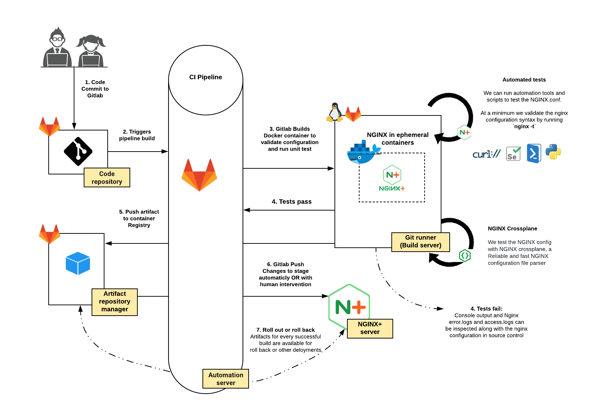
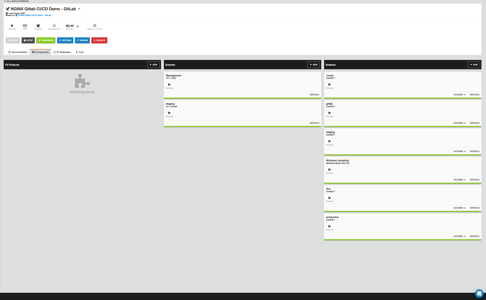
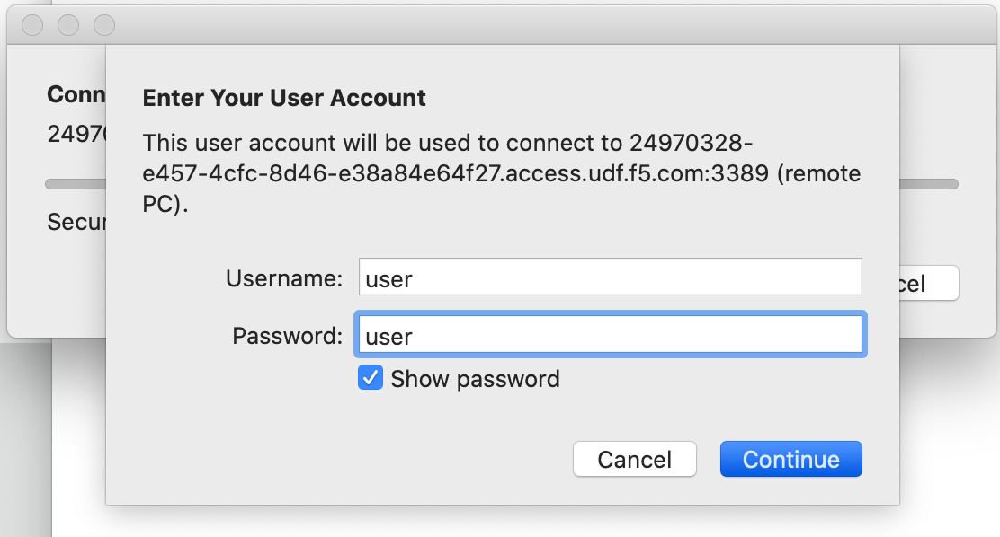
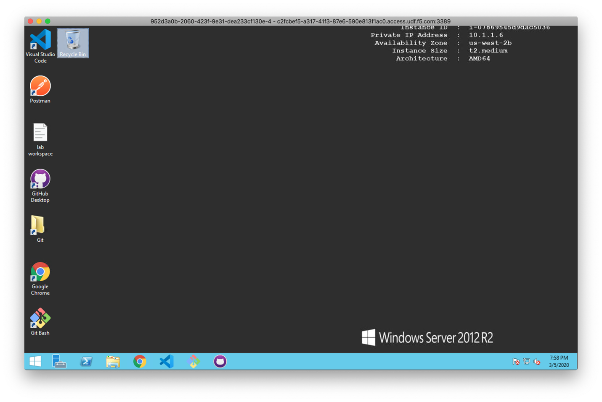

Introduction
============

The purpose of this Lab is to introduce Continuous
integration/continuous delivery (CI/CD) as a modern approach to managing
the entire life cycle of writing, updating, and delivering applications
with NGINX.

With CI/CD, everything from bug fixes to major feature changes are
delivered to users on an ongoing basis.

The byword of CI/CD is *automation* - the key factor that enables both
integration and delivery to be continuous. Once code is solid, the goal
is to eliminate the need for human intervention between the submission
of code for integration and the delivery of the same code into the
production environment.

[NGINX](https://nginx.org/en) and [NGINX Plus](https://www.nginx.com/products/nginx) agile and lightweight design make them extremely easy to be deployed in a consistent CI/CD process.
NGINX native configuration language is only flat files organized in
logical folder structures; this makes keeping a source of truth for
NGINX configurations in source control trivial. Furthermore, NGINX and
NGINX Plus can be deployed in various form factors (Virtual Machine,
Bare Metal, Cloud platforms, and Containers) which allows the NGINX
artifact of a CI/CD process to be:

-   NGINX configurations files - organized in logical files and folders
    like any other code language

-   Docker Container

-   Virtual Machine image -- e.g., `OVF`, `OVA`, `qcow2`, propriety cloud
    images, etc.

-   Any Other PaaS or IaaS manifests -- e.g., Kubernetes manifests,
    Packer, Terraform, etc.

This Lab guide will help you complete the following:

1.  Creating NGINX Plus Docker container images through a CICD process
    and using a private repository for NGINX Plus container images

2.  Deploying [NGINX Plus](https://www.nginx.com/products/nginx/) Web
    Server through a CICD process

3.  Deploying [NGINX Plus](https://www.nginx.com/products/nginx/) Load
    Balancer server through a CICD process

Below is a diagram of a generic CICD Pipeline of NGINX Plus. We will
walk through elements of the C

[Getting Started](https://clouddocs.f5se.com/NGINX-Controller3-Demo/intro.html#getting-started)

The infrastructure is all ready for you. GitLab-CE Server, Gitlab
Runner, NGINX Plus, Client JumpHost, Staging, and Production environment
are all setup.

The **JumpHost** (Windows) is already set up all the tools required to edit
and commit changes to our Dockerfiles, example "Appster" Web Application
and NGINX Plus configurations. It is recommended to run all lab
activities from the JumpHost

The **Chrome web browser** has been set up with bookmarks to all the web
applications you need for this lab.

**Shell access** to the Staging and Production environment is required for one excercise
and is useful to look "under the hood" of deployments to Linux servers in a live environment.

Lab Topology
------------

The lab environment consists of the following components. This is only
for your information, and we will not be accessing all these servers
during this lab

### Infrastructure Machines:

-   JumpHost Windows Server 2012 R2. RDP Access
-   Staging server - CentOS 7 Docker host. HTTP -- port 81, SSH
-   Production server - CentOS 7 Docker host. HTTP -- port 81-84, SSH
-   Gitlab-CE Server - CentOS 7. HTTP 80, SSH
-   Gitlab Runner Server - CentOS 7 Docker host/ SSH
-   BIND DNS Server - CentOS 7. SSH

Credentials
-----------

We will be required to access the following systems and web pages during
this lab

| **Component**                                | **Credentials**   |
|----------------------------------------------|-------------------|
| **JumpHost (Windows 2012) - Access via RDP** | user / user       |
| **GitLab GUI -** <http://10.1.1.5>           | udf / P\@ssw0rd20 |
| **Staging Server -- Appster** <http://docker.f5demolab.com> (10.1.1.11)               | n/a               |
| **Production Server -- Appster** Four backend (containers): -   Appster-blue <http://10.1.1.11:81> -   Appster-green <http://10.1.1.11:82> -   Appster-yellow <http://10.1.1.11:83> -   Appster-red <http://10.1.1.11:84>             | n/a               |

To get started with the lab exercises, open an RDP session to the
Windows server 2012 JumpHost \> Access \> RDP

{width="6.5in"
height="5.197915573053368in"}

To get an open a preset screen resolution RDP session click on Details
\> RDP \> Select an RDP screen resolution

{width="6.5in"
height="3.0833333333333335in"}

When prompted for your User Account details, enter:

`user`/`user`

The Windows JumpHost is now ready for the lab

