Exercise 2: Deploying NGINX [Plus](https://www.nginx.com/products/nginx/) web server with CICD
----------------------------------------------------------------------------------------------

This lab exercise will guide us through deploying an NGINX Plus Web
server through a CICD Pipeline, a best practices for DevOps teams to
implement, for delivering code changes more frequently and reliably.

We will be making simple changes to our web application and rapidly push
the new code to live environments. For this use case, we will again be
building and pushing Docker containers as our deployment artifact.

### CICD flowchart

**The diagram below depicts the workflow from code to deployment.** Our CICD
Pipeline docker image to the container registry but could easily be
extended to deploy a container with a new application code to a live
environment. We will see in this exercise that the push to Staging
environment is automatic while the push to our production environment
requires a human trigger

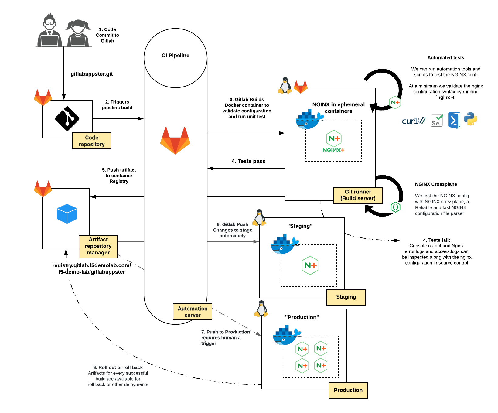

### Task 1: Make new code commit, push changes and deploy to Staging and Production

In this example, we will make a simple change in updating the phone
image on the homepage. We will then commit our changes and push the new
code to our Gitlab repository; this will automatically trigger a CICD
pipeline.

A successful build will result in storing the Docker container artifact
in a private Container Registry; this is the new stable build of NGINX
Plus containing the new web application code.

The last phase of the CICD Pipeline will deploy the new container to our
Staging Server automatically but wait for a human trigger to deploy the
containers to Production. Note that we will deploy four instances (four
containers) to Production to illustrate NGINX Plus as a Load Balancer in
the next exercise

1.  Open the GitHub Desktop client and make sure the current repository
    selected is `gitlabappster`

    From the same screen now click the **"Open in Visual Studio Code"**
    button to start editing our appster web application code

    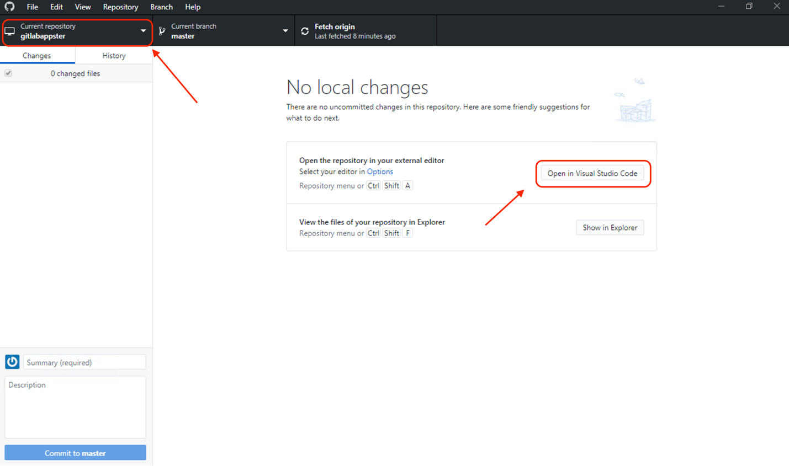

    Now that Visual Studio Code is open, expand the tree under `gitlabappster` -> `etc` -> `nginx` -> `html`. Once the tree has been opened, find `index.html` file and right click on it. A menu will open up. Select: **"Reveal in File explorer"** to open it up in windows explorer.

    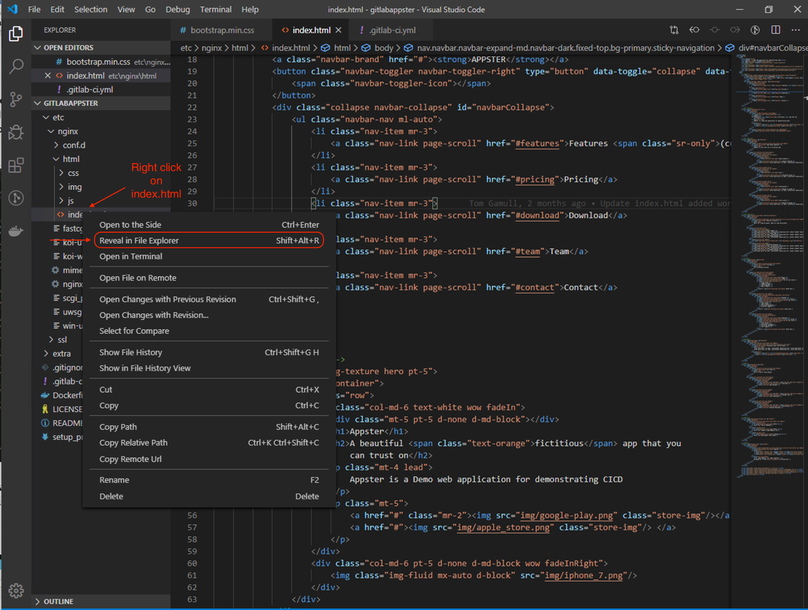

2.  Once **windows explorer** has opened at the location of the file,
    you will see the folder with `index.html` listed. Go ahead and
    double-click `index.html` to open that file in a browser (Google
    Chrome.)

    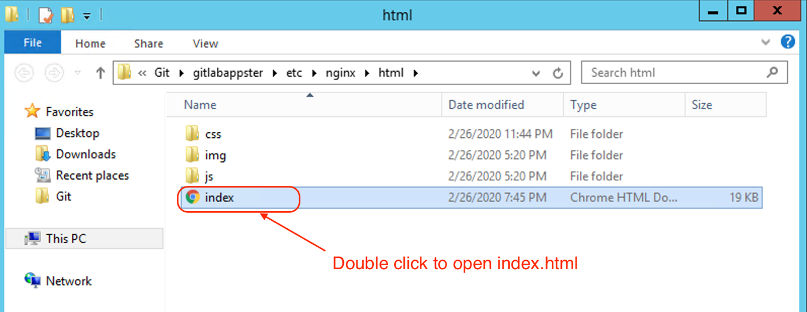

3.  After the double-click on `index.html`, and opening the webpage
    in the web browser, you will see the current webpage displaying the
    Appster application with a dated iPhone 7 image. *Go ahead and
    leave this web browser page open.*

    

4.  Go back to Visual Studio code editor to make edits to this file.
    This time, open that same `index.html` file (click to open it in
    visual studio code.)

    Once the file is open, we are now going to find and replace the
    current iPhone image (currently set to `iphone_7.png` and
    change it to `iphone_x.png` Hit **Ctrl+F**, which opens the
    find window and type in `iphone_7.png`. You should have two hits
    (just to the right of the find window).

    Search and replace all instances of `iphone_7.png` to
    `iphone_x.png`. Update all two instances of that image

    

5.  Once you have edited `index.html` and replaced both instances of
    `iphone_7.png` with `iphone_x.png`, go ahead and save the
    file. You can navigate to `file` -> `save` or you can use the shortcut,
    **CTRL+S**. **(NOTE:** Do not change the file name. Keep it the same.)

6.  Open or switch back to the **GitHub Desktop Client** and see the
    tracked changes made.

    The GitHub Desktop Client has automatically tracked the changes that
    were made on `index.html` and is highlighting those exact changes,
    `iphone_7.png` replaced with `iphone_x.png`.

7.  We now can push these changes to our repository on GitLab. In the
    lower-left of the GitHub, Desktop Client provide a **Commit title** and
    **notes** before we can **commit** to master:

    You can see two boxes. Go ahead and type in the title field: "update
    index.html".

    Additionally, you can provide notes as well, type in the notes field:
    "Update phone image"

    Once you fill in both boxes, click on **Commit to Master** and on
    the next screen, press **Push to Origin** to push the new code
    commit to our git repository on Gitlab.

    

8.  After you click on **Commit to Master**, you will be taken to
    the next page where we push our changes to our repository. Go and
    click **push origin**, which will now push our modified
    `index.html` file to our GitLab repository.

    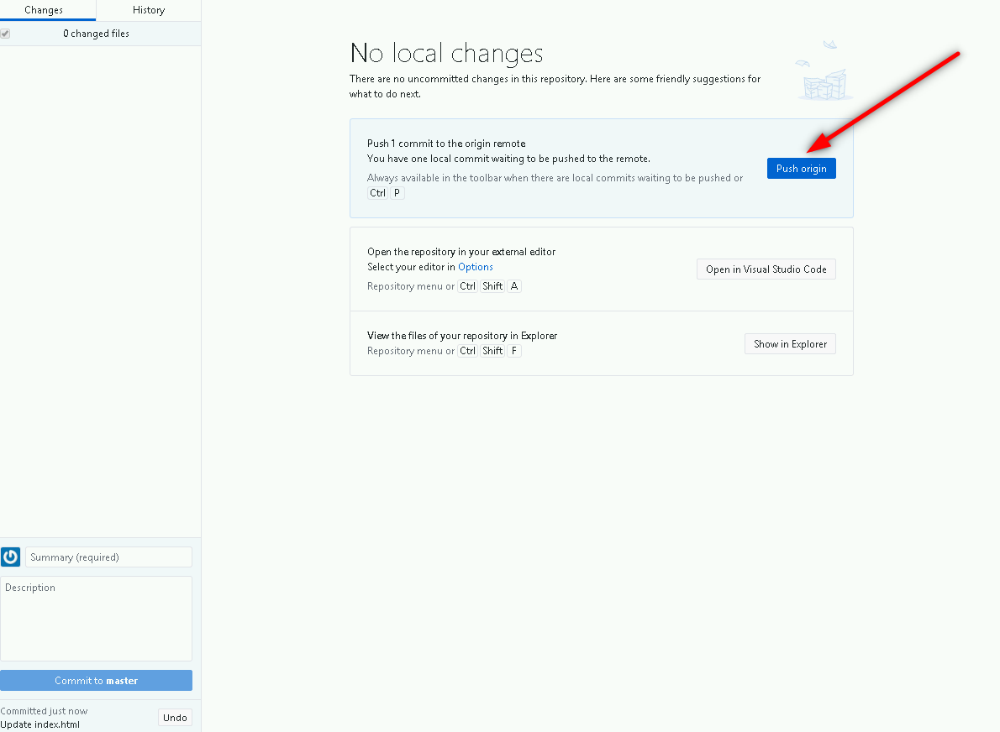

9.  Open up the Appster repo on Gitlab, using the
    URI [`https://gitlab.f5demolab.com/f5-demo-lab/gitlabappster`](https://gitlab.f5demolab.com/f5-demo-lab/gitlabappster) or
    using the **Appster** shortcut provided. This is our repository,
    where we just pushed our modified `index.html` file to.

    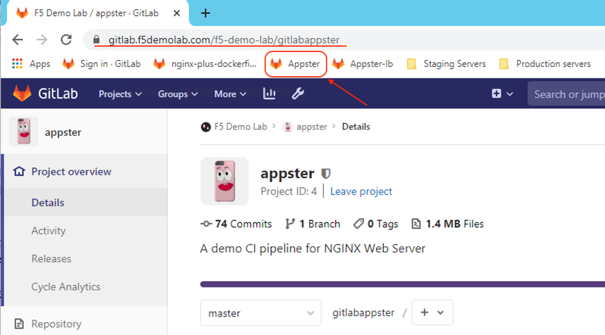

10. In the middle of the Appster repository, you will see the pipeline
    status icon next to the latest Commit SHA. When the pipeline is
    currently in progress, you will see an **orange icon** (waiting to
    start), **blue circle** (running) ), or a green check (passed). Hopefully, we don't see
    a **red icon**, which indicates the pipeline has failed. We can
    click on the pipeline status icon to view the pipeline progress

    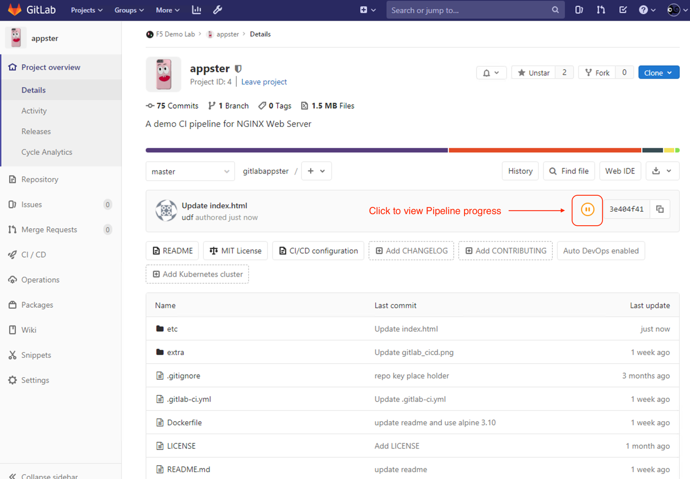

    The next screen shows a high-level view of the pipeline triggered for
    this commit. We can click on the pipeline status icon on this screen to
    view the pipeline progress in greater detail.

    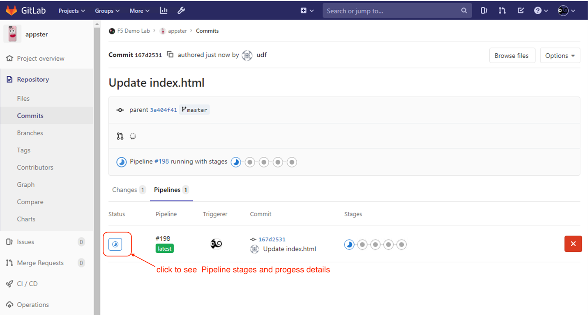

11. After clicking on the pipeline status icon, we can view the full
    pipeline. As you can see, we can now see our pipeline: `BUILD`,
    `TEST`, `PUSH`, `DEPLOY`, and `CLEANUP`. This pipeline was
    automatically triggered after we submitted our changes to index.html
    (when we clicked **push origin**.) and we can see at a high level
    the stages in the pipeline progressing

    

12. As part of our Continuous Delivery, deployment to Staging is
    automatic, and Production is manual: we have purposely injected 
    the requirement for a human trigger for deployment to Production

    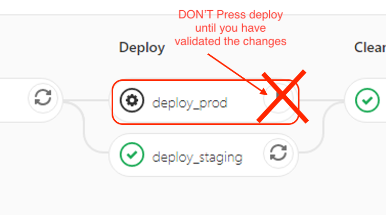

13. Browse to the server bookmarked as `STAGING LB - Appster` under 
    the **"Staging Servers"** bookmark folder to see the new web app 
    code pushed to our Staging Server.

    > **Note:** Ignore the bookmarks `STAGING LB - Appster` and 
    `PROD LB - Appster` for now - we will set this up in a later exercise.

    Open the webpage in a **New incognito window (Ctrl + Shift + N)** 
    to bypass browser cache and view changes.

    

    **After new code commit:**

    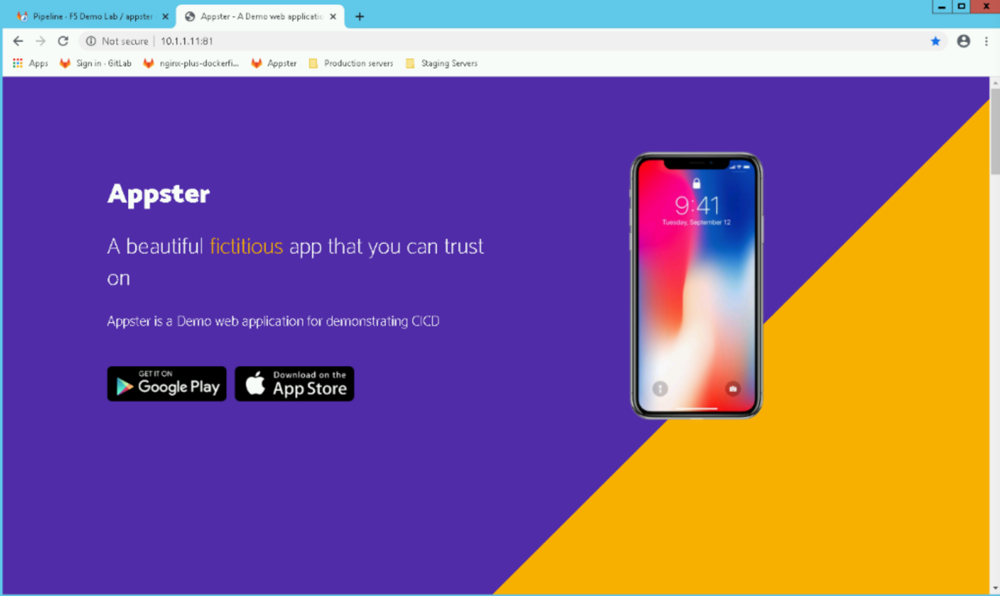

14. If our code changes pushed to staging are successful and the changes are 
    validated to be correct, we can can now deploy to Production:

    Under the `DEPLOY` stage, we have the option to deploy to Production
    manually. Go ahead and click on the little **Play** button that is on
    the `deploy_prod` stage of the pipeline. This trigger will now
    deploy our new Docker image to Production, wih. the new code showing the
    updated image, `iphone_x.png`.

    

    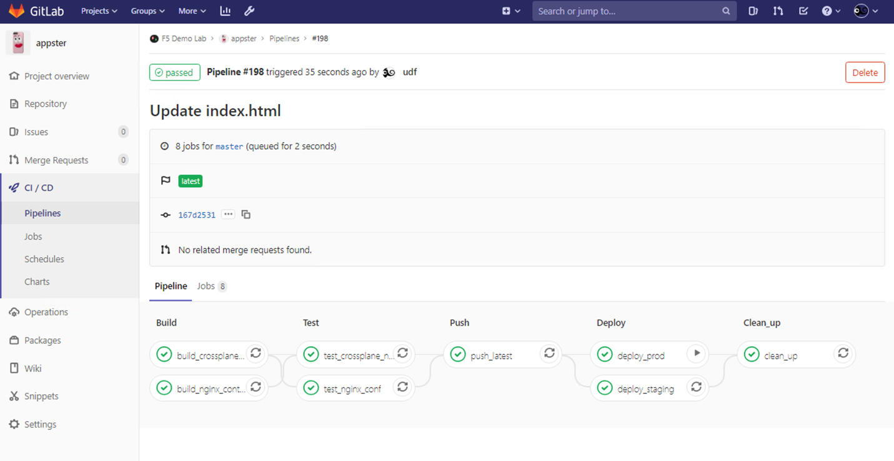

15. If our deployment to Production is successful you would now see
    the new web app code now deployed on **all four Production web servers**; 
    we can see that on any Web Servers bookmarked as `PROD WEB - Appster-red`, 
    `PROD WEB - Appster-yellow`, `PROD WEB - Appster-green` and `PROD WEB - Appster-blue` 
    under the **Production Servers** bookmark folder. 

    
    

### Task 2. Made new code commit, push changes using command line tools, and deploy

In this task, we will run through a similar process, but this time
achieve similar changes via a bash shell using Unix commands, a
different perspective to application development!

1.  Open **git bash for windows** using the **Git Bash** icon on the Windows
    desktop. Git Bash is a bash shell emulator, similar to what you see
    natively on Linux and Unix machines. If the git console font is too
    small to read, use **Ctrl+ "+"** to increase the font

    

2.  Make sure you are in appster project root:
    `~/Documents/Git/gitlabappster` . To get there, type the
    following command in the Git Bash shell:

    ```bash
    cd ~/Documents/Git/gitlabappster
    ls
    ```

    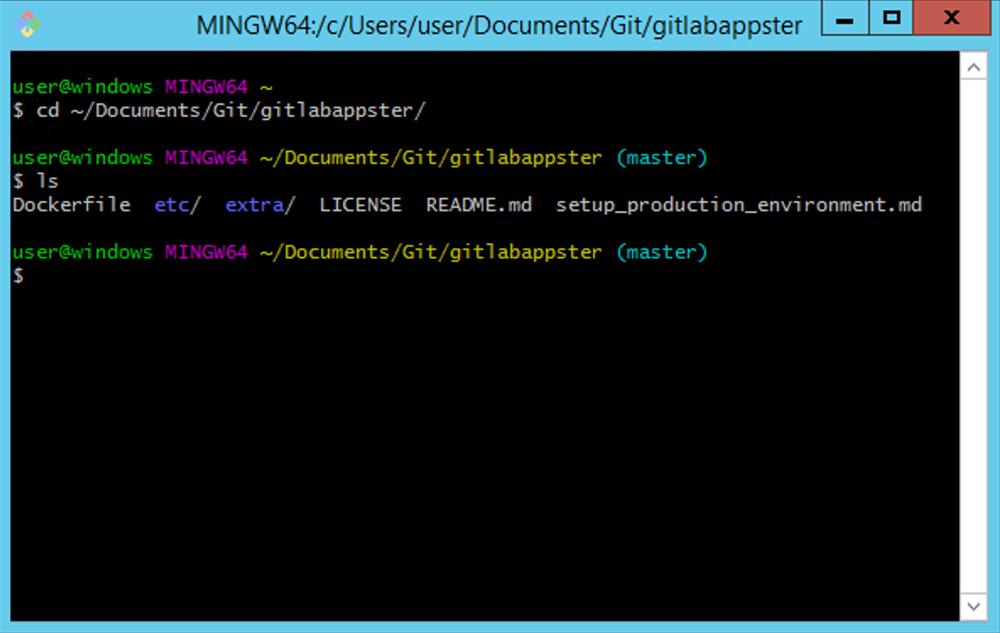

3.  We can change the the subheader
    using [sed](https://www.gnu.org/software/sed/manual/sed.html). `sed` command
    in UNIX stands for *Stream EDitor*, and it can perform lots of
    function on file like searching, find and replace, insertion or
    deletion

    Let's search and replace the the existing subheader `A beautiful fictitious app that you can trust on` with `A beautiful fictitious app that you can trust!`.
    The following command will flip background colors - yellow to purple, purple to yellow:

    ```bash
    # Update "A beautiful fictitious app that you can trust on" 
    # with "A beautiful fictitious app that you can trust!" in the HTML
    sed -i 's/app that you can trust on/app that you can trust!/g' etc/nginx/html/index.html
    ```
4.  Let's check that our changes were made by performing a `grep` text search 
    on the `index.html` file

    ```bash
    # Do a grep search and look for the subheader
    cat etc/nginx/html/index.html | grep "A beautiful"
    
    <h2>A beautiful <span class="text-orange">fictitious</span> app that you can trust!</h2>
    ```

5.  We now can commit and push changes to the git code repository using
    **git commands** instead of the GitHub Desktop Client. Type the
    following three commands sequentially.

    ```bash
    git add .
    git commit -m "Update subheader"
    git push origin master
    ```

    If prompted for credentials, enter our Gitlab username and password: `udf` / `P@ssw0rd20`

    

    A successful push will look like the following:

    

6.  We view the changes made in the new code deployment
    in a web browser. Remember that you may need to reload the webpage
    if you currently have the webpage open, or open the webpage in
    a **New incognito window** (**Ctrl + Shift + N**) to bypass browser
    cache and view updated changes

    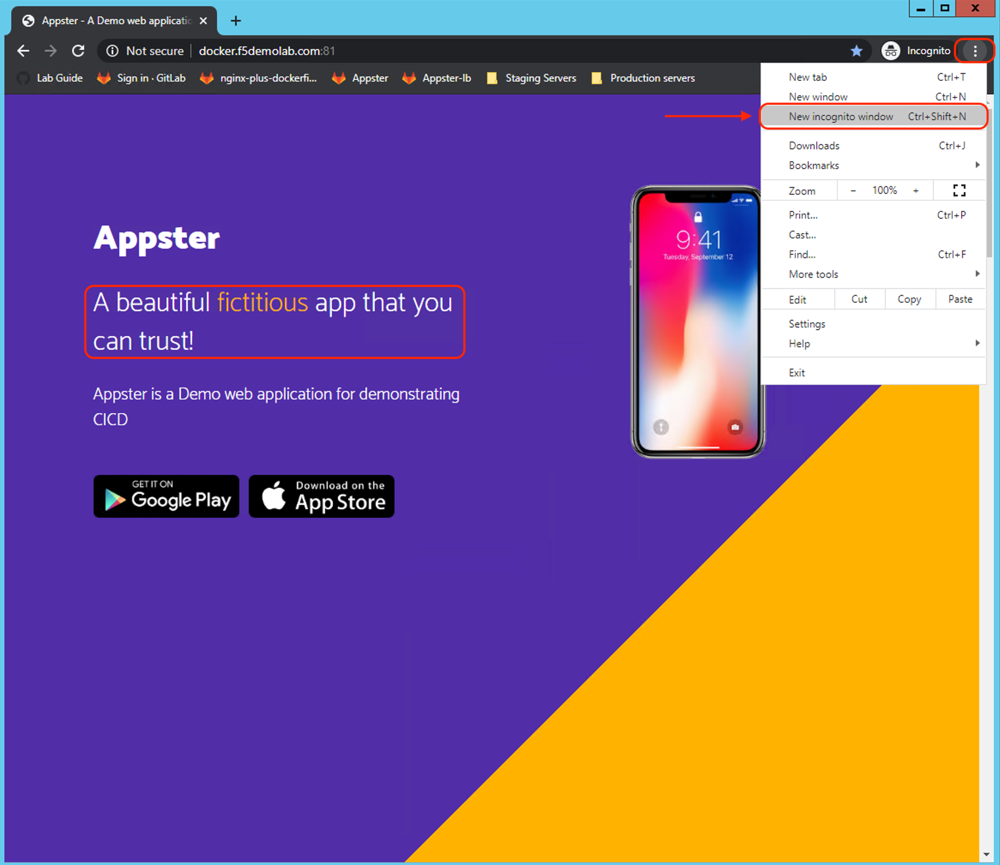

7.  If you prefer a different subheader again, we can change it once again
    using [sed](https://www.gnu.org/software/sed/manual/sed.html) this time
    performing a search and replace of the the HTML code containing `A beautiful fictitious app that you can trust!` with `Whatever you want!`.

    For example we are matching the entire html `<h2>` block and have [escaped](http://dwaves.de/tools/escape/) the HTML code:

    ```bash
    # Flip background colors - purple to yellow, yellow to purple:
    sed -i 's/<h2>A beautiful <span class=\"text-orange\">fictitious<\/span> app that you can trust!<\/h2>/<h2>A beautiful <span class=\"text-orange\">fictitious<\/span> app that you should download!<\/h2>/g' etc/nginx/html/index.html
    ```
8.  Once again, let's check that our changes were made by performing a 
    `grep` text search on the `index.html` file

    ```bash
    # Do a grep search and look for the subheader
    cat etc/nginx/html/index.html | grep "A beautiful"
    
    <h2>A beautiful <span class="text-orange">fictitious</span> app that you should download!</h2>
    ```

9.  Once again, commit and push changes to code repository:

    ```bash
    git add .
    git commit -m "Update subheader"
    git push origin master
    ```

    Again, if prompted for credentials, use: `udf` / `P@ssw0rd20`

    

    A successful push will look like the following:

    

10. Browse back to the **Appster** repo on **Gitlab**, click the pipeline status
    icon to get back to the detailed pipeline progress page and watch
    the build process in real-time

    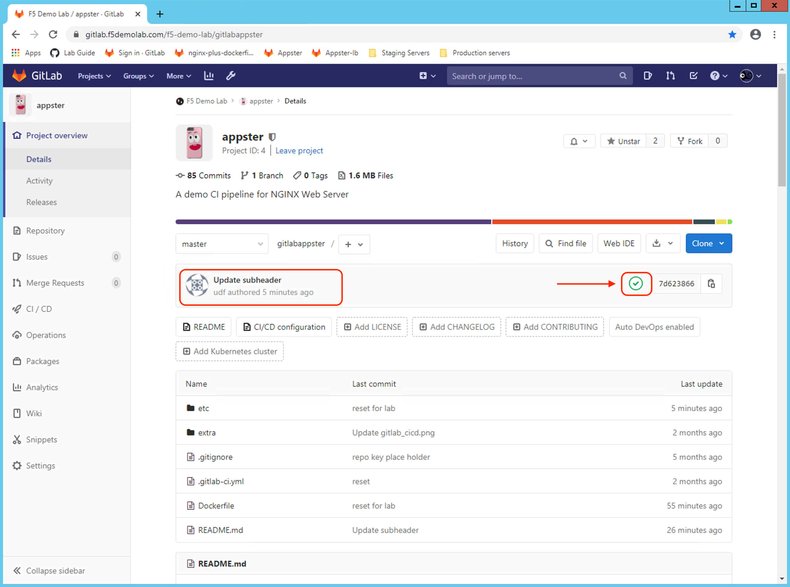

    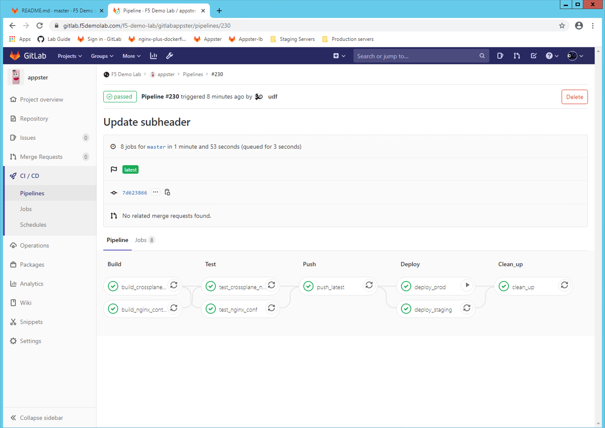

11. Once again, we can view the changes made in the new code deployment
    in a web browser. Remember that you may need to reload the webpage
    if you currently have the webpage open, or open the webpage in
    a **New incognito window** (**Ctrl + Shift + N**) to bypass browser
    cache and view updated changes

    

-------------
### Navigation
> [<= **Previous** - Exercise 1](../1.0.creating-docker-images-for-nginx-plus/1.0.creating-docker-images-for-nginx-plus.md) | 
> [**Next** - Exercise 3 =>](../3.0.continuous-deployment-for-nginx-plus-load-balancers/3.0.continuous-deployment-for-nginx-plus-load-balancers.md)